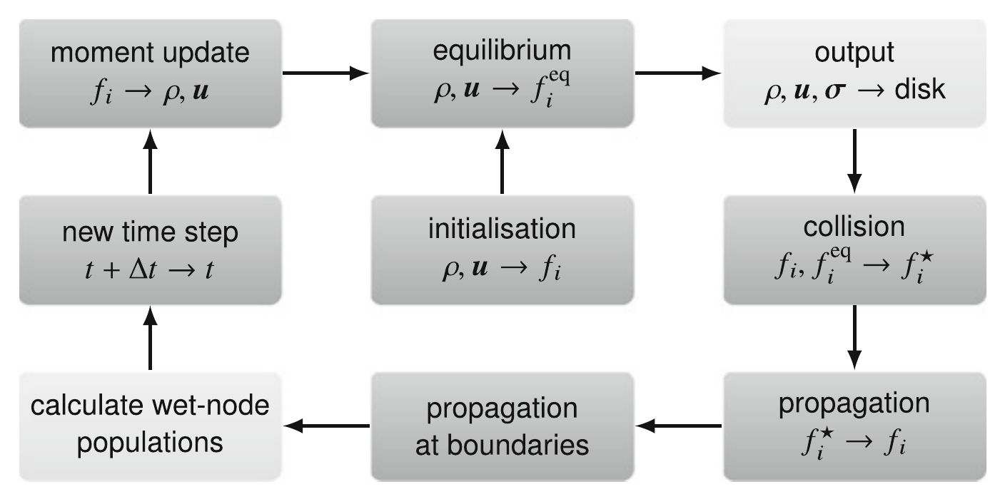
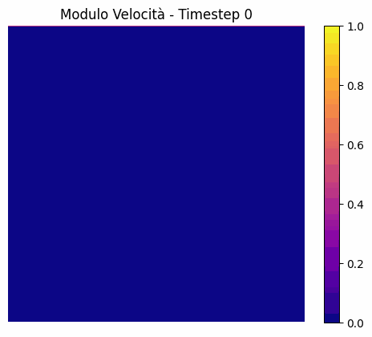
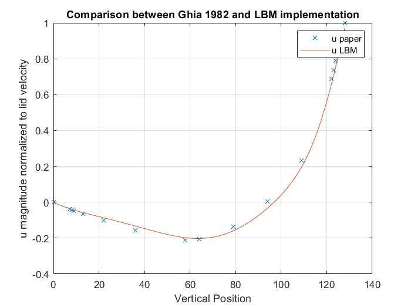
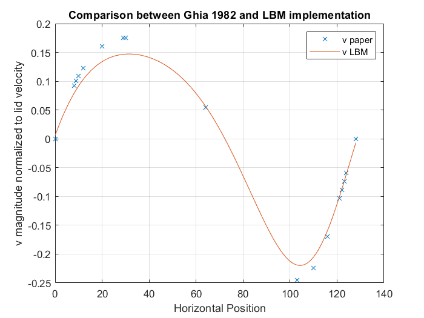
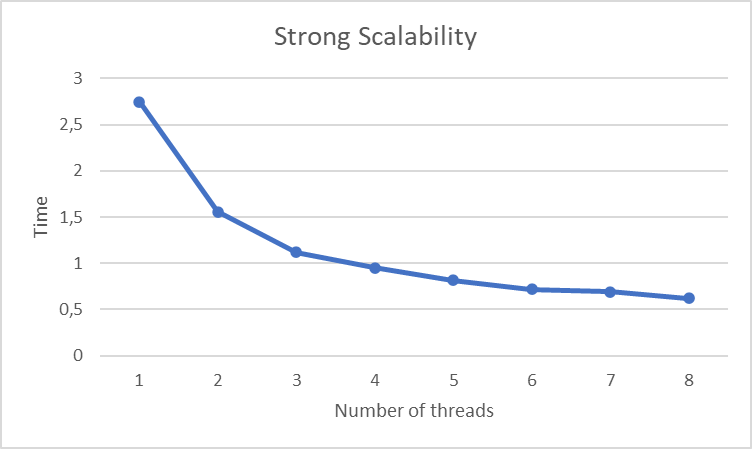
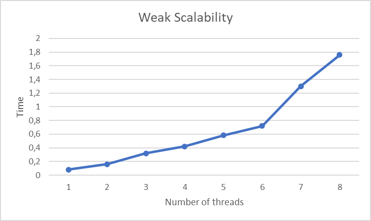

# Lattice Boltzmann Method (LBM) Simulation

## Overview
This project implements a Lattice Boltzmann Method (LBM) simulation, a numerical method widely used in fluid dynamics and related computational physics applications. The project is written in C++ and includes core functionalities to initialize the simulation, handle collisions and streaming, apply boundary conditions, and visualize results.

## Algorithm
The Project follows the algorithm idea described in "An Introduction to the Lattice Boltzmann Method: A
Numerical Method for Complex Boundary and Moving Boundary Flows." (Inamuro, T., Yoshino, M., & Suzuki, K.)

<p align="center">
  
</p>

## Features
- Configurable grid size and simulation parameters.
- Implements core LBM operations (collision, streaming, boundary conditions).
- Parallel implementation using OpenMP.

## File Structure
- **`LBM.h`**: Header file defining the `LBM` class, constants and its methods.
- **`LBM.cpp`**: Implementation of the `LBM` class, including the main computational methods.
- **`main.cpp`**: Entry point for the simulation. Sets up the `LBM` object, initializes parameters, runs the simulation, and outputs results.

## Requirements
- g++ compiler with C++17 support or higher.
- OpenMP dev package.

## Requirements
- g++ compiler with C++17 support or higher.
- Eigen3-dev package.
- OpenMP dev package.
- singularity-ce

## Compilation and Execution
full pipeline (build mpi executable - build singularity container - run ) included bash file:
   ```bash
   bash singularity_full_pipeline.sh
   ```
or fast build and execution:
   ```bash
   bash mpi_fast_test.sh
   ```


## How to Use
1. Modify the simulation parameters in `main.cpp` to suit your needs (e.g., grid size, time steps).
2. Compile and run the simulation.
3. Run the bin_to_gif.py to create the visualization representation of the simulation.

## Example Output
The simulation outputs velocity fields, density distributions, and other relevant physical quantities. 
 Each output is saved as a binary file at each timestep and can be converted to a GIF.

The final result is a GIF like this:

<p align="center">
   
</p>

## Code Validation
To verify the correctness and physical behavior of the model, a comparison was made with results from <a href="https://www.sciencedirect.com/science/article/pii/0021999182900584">"U. Ghia, K. N. Ghia, C. T. Shin, *High-Re solutions for incompressible flow using Navier-Stokes equations and multigrid method*"</a>. Data correspond to the geometric center of the cavity at Re = 100.

<p align="center">
   
</p>

## Strong and Weak Scalability Test
The model has been parallelized using OpenMP. In order to understand how performance scales with the dimension of the domain and with the number of threads used during the computation, some scalability tests have been performed.

<p align="center">
   
</p>

## Authors
Luca Donato, \
Leonardo Arnaboldi, \
Fabio Ghattas,\
 Luis Felipe Epia Realpe,\
 Tommaso Angelaccio

