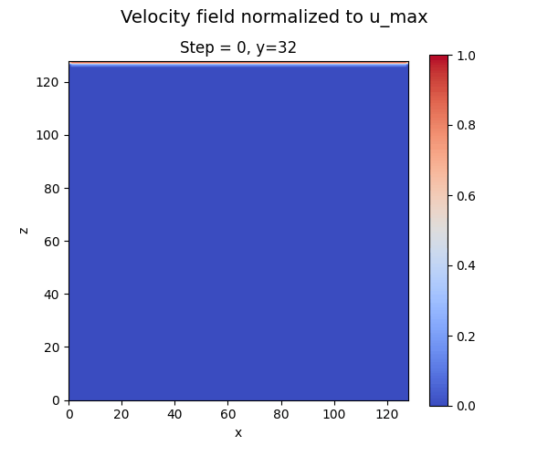
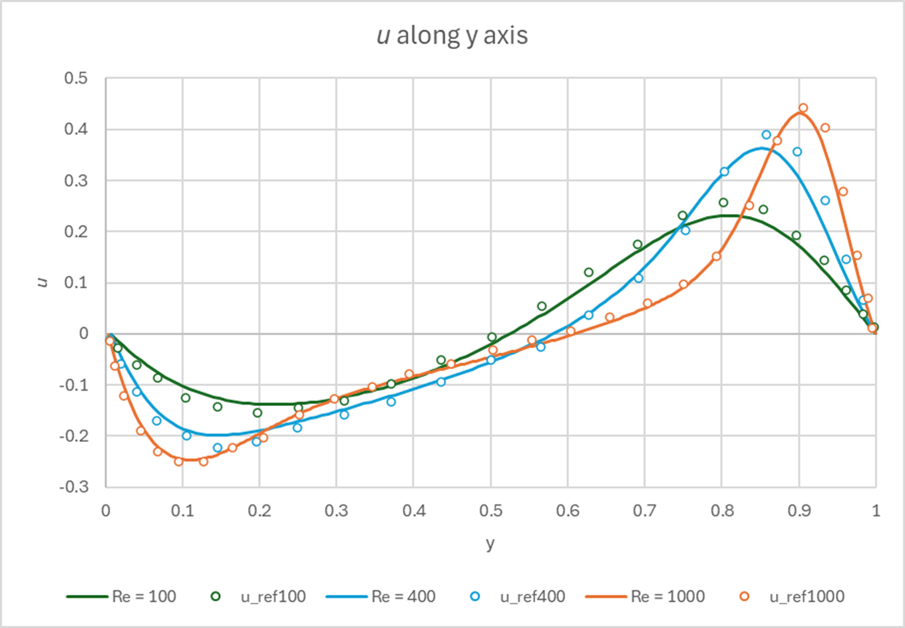
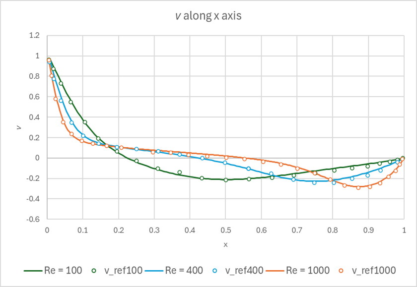

# Lattice Boltzmann Method (LBM) Simulation

## Overview
This project implements a Lattice Boltzmann Method (LBM) simulation, a numerical method widely used in fluid dynamics and related computational physics applications. The project is written in C++ and includes core functionalities to initialize the simulation, handle collisions and streaming, apply boundary conditions, and visualize results.

## Algorithm


The project follows the algorithm idea described in <a href="https://link.springer.com/book/10.1007/978-3-319-44649-3">"
    T. Krüger, H. Kusumaatmaja, A. Kuzmin, O. Shardt, G. Silva and E. M. Viggen, <i>The Lattice Boltzmann Method - 
Principles and Practice</i>"
</a>.

<p align="center">
  
</p>

## Features
The implementation is inspired by the math and science libraries we deal with in other HPC courses. A set of modular classes and other features grant high configurability in simulation setting.
- The `LBM` class is the core of the simulation. It allows to set simulations with domains of different dimensionality and velocity sets, and fluid density. It implements the main steps of the simulation as intializing the domain at equilibrium or streaming and collide operations, in a modular fashion. 

- Freedom in setting is mainly granted from the implementation of initial and boundary conditions as functions created outside of the class, from the user himself maybe, but called from the class object. Similarly, obstacles are implemented as classes derived from an abstract functor class, that can be added as members of an object of the `LBM` class.

- Performance needs asked for parallelization: the methods are implemented to work with OpenMP and MPI.


## Main File Structure
- **`LBM.hpp`**: Header file defining the `LBM` class, constants and its methods.
- **`LBM.cpp`**: Implementation of the `LBM` class, including the main computational methods.
- **`Obstacle.hpp`**: defines the abstract class for obstacles.
- **`LidDrivenCavity3D.hpp`** and **`LidDrivenCavity3D.cpp`**: specific declaration and definition of a set of initial and boundary conditions that can be added to and `LBM` object to simulate a cavity with a moving wall.
-**`ObstacleLiftDrag.hpp`**: an obstacle implementation for cubic, still obstacle.
- **`main.cpp`**: Entry point for the simulation. Sets up the `LBM` object, initializes parameters, adds initial and boundary conditions for the cavity simulation, adds an obstacle, runs the simulation, and outputs results.

## Requirements
- g++ compiler with C++17 support or higher.
- Eigen3-dev package.
- OpenMP dev package.
- MPI dev package
- singularity-ce

## Compilation and Execution
full pipeline (build mpi executable - build singularity container - run ) included bash file:
   ```bash
   bash singularity_full_pipeline.sh
   ```
or fast build and execution:
   ```bash
   mkdir build
   bash mpi_fast_test.sh
   ```


## How to Use
1. Modify the simulation parameters in `main.cpp` to suit your needs (e.g. grid size, time steps, obstacle) and Reynolds number in `LidDrivenCavity3D.hpp`.
2. Run `mpi_fast_test.sh` to build and run the code.

If you want to play around without following the bash script, remember to run cmake inside the `build` folder, and to run any execution form the `Project` folder, for file management reasons.

## Example Output
The simulation outputs velocity fields. 
 Each output is saved as a binary file at each timestep and can be converted to a GIF or VTK files.

The final result is a GIF like this:

<p align="center">
   
</p>

## Code Validation

To validate the 3D version of the code, the results were compared with those obtained through the pseudospectral method from <a href="https://www.sciencedirect.com/science/article/pii/0021999187901902">"
    Hwar C. Ku, Richard S. Hirsh, Thomas D. Taylor, <i>A pseudospectral method for solution of the three-dimensional incompressible Navier-Stokes equations</i>"
</a>. Data correspond to values of normal velocities along the axes parallel to the x- and y-axis passing through the center of a cubic cavity, with Re = 100, Re = 400 and Re = 1000.

<p align="center">
   
  
</p>


## Authors
Luca Donato, \
Leonardo Arnaboldi, \
Fabio Ghattas,\
 Luis Felipe Epia Realpe,\
 Tommaso Angelaccio

